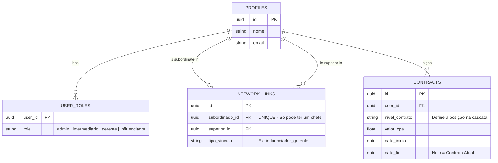
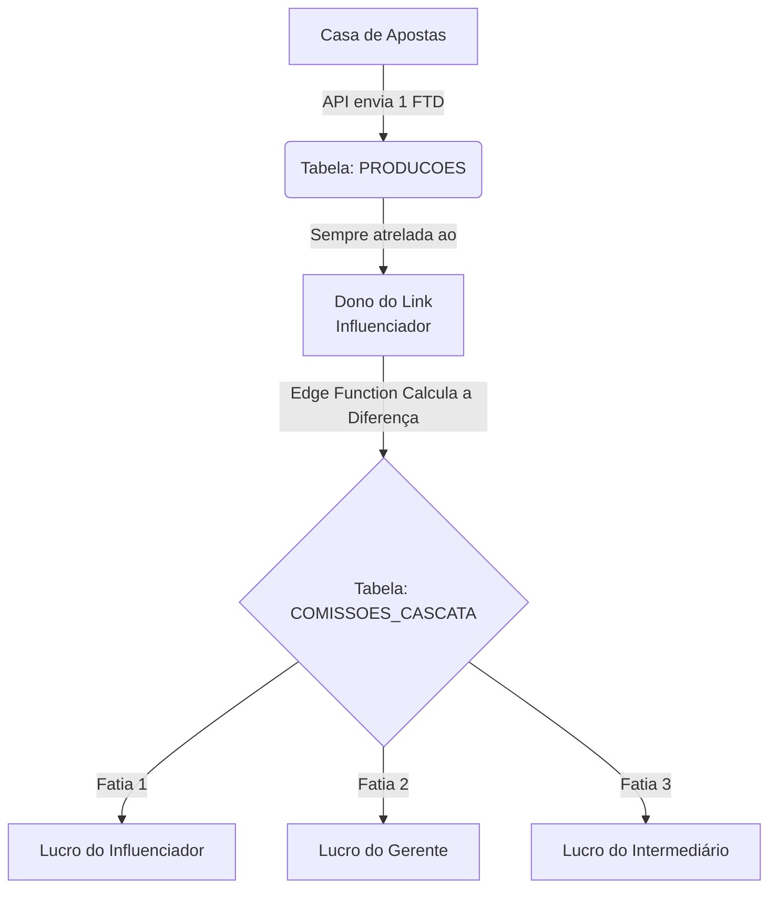

# 🏦 Arquitetura de Contratos e Cascata Financeira (Project Orbit)

> [!NOTE]
> Este documento é o mapa arquitetural para o sistema de afiliação multinível do Project Orbit. Ele define como os papéis, hierarquias, contratos e o cálculo de comissões (cascata) devem ser armazenados e processados.

---

## 1. Nomenclatura Oficial
Para extinguir os bugs do sistema legado (onde UI e DB não conversavam), a nomenclatura no Banco de Dados **deve ser estritamente igual** à da Interface:

| Nível | Nomenclatura no Banco/UI | O que faz |
| :---: | :--- | :--- |
| **0** | `admin` | Controle total (Blackbox). |
| **1** | `intermediario` | Topo da rede comercial. Recruta gerentes. |
| **2** | `gerente` | Meio do campo. Recruta influenciadores. |
| **3** | `influenciador` | Ponta de lança. Gera tráfego e FTDs. |

---

## 2. Modelagem do Banco de Dados

Para suportar usuários com **múltiplos perfis** (Ex: Gerente E Influenciador) sem duplicar cadastros, fragmentamos os dados:

### 2.1. Regras Estritas de Hierarquia (A Árvore)
> [!WARNING]
> Para garantir que a cascata nunca falhe ou entre em loop, o banco de dados deve ter travas fortes (Constraints / Triggers) nas relações da tabela `NETWORK_LINKS`:

1. **Unicidade de Superior:** Um subordinado **só pode ter um único chefe ativo**. A coluna `subordinado_id` deve ter restrição de unicidade (`UNIQUE`).
2. **Proibição de Vínculo Horizontal:** Um papel nunca pode se ligar ao mesmo papel (Influenciador ❌ Influenciador).
3. **Escada Estrita:** A ligação é sempre um degrau exato para cima:
   * **Influenciador** → pertence obrigatoriamente a um **Gerente**.
   * **Gerente** → pertence obrigatoriamente a um **Intermediário**.
   * **Intermediário** → opera no topo (responde diretamente à Blackbox).

### 2.2. Regras de Ouro
> [!IMPORTANT]
> **Contratos nunca são editados.** Se houver reajuste, o sistema deve preencher a `data_fim` do contrato atual e criar um novo com a `data_inicio` atualizada.
> 
> **Múltiplos Contratos:** Se João atua como *Gerente* e *Intermediário*, ele possuirá duas linhas ativas na tabela `CONTRACTS` (uma para cada nível).

---

## 3. O Paradoxo: Produção vs. Comissão

O segredo para um painel sem dados duplicados é separar **o evento que gerou o dinheiro** de **quem vai receber o dinheiro**.

### 3.1. Tabela `producoes` (O Fato Bruto)
Registra o que aconteceu na casa de apostas. **Apenas o dono do link entra aqui.**
* `influenciador_id` (Exclusivo)
* `valor_gerado` (Ex: 1 Cadastro)

### 3.2. Tabela `comissoes_cascata` (A Fatiadora)
Ao registrar uma produção, o sistema mapeia a rede do influenciador, subtrai as margens e gera múltiplas faturas baseadas nessa única produção.
* `producao_id` (Link para o fato gerador)
* `beneficiario_id` (Quem recebe o pedaço)
* `papel_recebedor` (Como ele recebeu)
* `valor_recebido` (R$)

---

## 4. A Matemática da Margem (Na Prática)

O repasse é calculado pela lógica atacadista: **`Receita Bruta` - `Custo da Rede Abaixo` = `Margem de Lucro`**.

Imagine a seguinte cadeia onde a Casa paga R$ 200 por CPA:

| Participante | Contrato Ativo | Cálculo do Lucro Líquido | Ganho Final |
| :--- | :---: | :--- | :---: |
| **Influenciador** | R$ 150 | Não tem subordinado para pagar. Fica com os 150. | **R$ 150** |
| **Gerente** | R$ 180 | "Vende" por 180, mas precisa repassar os 150 do influencer. | **R$ 30** |
| **Intermediário**| R$ 200 | "Vende" por 200, mas precisa repassar os 180 do gerente. | **R$ 20** |

> [!TIP]
> Se a Casa de Apostas pagou R$ 250 para a Blackbox por esse CPA, a **Blackbox obteve R$ 50 de lucro**, já que o topo da cadeia custou apenas R$ 200.

### E se o usuário tiver duplo-perfil?
> [!NOTE]  
> Se o **Gerente** for a mesma pessoa que o **Influenciador**, o sistema lerá isso naturalmente. Ele ganhará **R$ 150** pelo `papel_recebedor = influenciador` e **R$ 30** pelo `papel_recebedor = gerente`, lucrando nas duas pontas sem bugar a contagem total de CPAs (que continua sendo 1).
